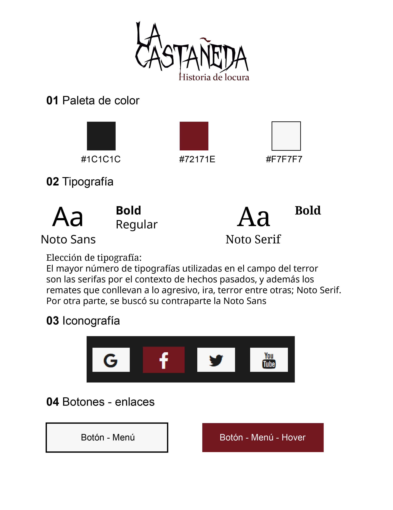

# Web
Castañeda

# Organización de secciones

## Wireframe del proyecto

;

## Contenido 
 <b>One page</b>

### Header - Nav - Menú
 - Secciones-botones: 
     
    I.- Logotipo: La Castañeda 
    II.- Leyenda 
    III.- Artefactos 
    IV.- Ambientación    
 
### HeroScreen  
  I.- Recuadro del nombre del recorrido (Texto: Ambientación 3D e Imagen: De la fachada 3D). {Opcional poner slider} 
 
### Section I - Objetivo  
 
I.- Concepto - objetivo  
 II.- Descripción del objetivo acerca del proyecto.
- (I y II en 2 columnas)
  
 ### Section II - Leyenda 
 
I.- Imagen. Hombre del muñeco.   
 II.- Historia de ficción - Texto: Leyenda y el relato.  
 - (I y II en 2 columnas)
 
### Section III - Artefactos
I.- 3 Fichas de los artefactos en 3D; Mueble, Banco y Cama (Imagen del modelado y sus generalidades).  
- (I en 3 columnas: Con información e imagen)  
  II.- Link para ver las fotografías originales; galería (Fotos de la Fachada, Mueble, Banco, Cama y Hombre del muñeco). 
- (Galería de 3 columnas y dos filas)
### Section IV - Ambientación 3D
 I.- Vídeo del Stand - recorrido   
 
### Footer 
I.- Logotipo ICONOS - Datos del instituto  
II.- Copy - Nombre del proyecto - Año  
- (I y II en 1 columna)
III.- Redes de la institución   
- (III en 1 columnas)

### Estilo de la página Web
;

## Estilo Web

;

logotipo 
paleta de color 
tipogrfía- description - mostrar por puntos (42) 
Título, cuerpo, footer- 
Iconografía(redes, flecha) 
Botones 

